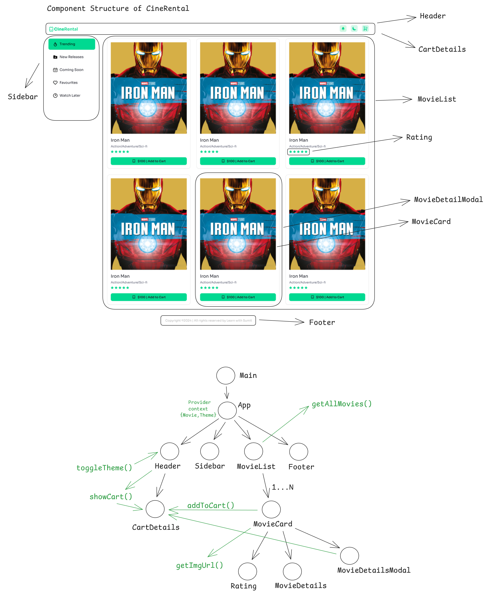

# CineRental Component Structure

Below is the component structure for CineRental, a fictional movie rental website. The structure was designed using Excalidraw to provide a high-level overview of the application's components and their relationships.

## Component Structure Diagram

## Key Components

- **App**: The main container component
- **Header**: Navigation elements (logo, theme, cart)
- **Sidebar**: Categorized movie list (trending, new releases, coming soon, favorites, watch later)
- **MovieList**: Contains movie collection
- **MovieCard**: Individual movie details (title, poster, rating, genre)
- **MovieDetailsModal**: Expanded movie information (add to cart, cancel)
- **CartDetails**: Shopping cart
- **Rating**: User ratings display
- **Footer**: Copyright message

## Component Relationships

- **App** contains **Header**, **Sidebar**, **MovieList**, and **Footer**
- **MovieList** renders multiple **MovieCard** components
- Clicking a **MovieCard** displays the **MovieDetailsModal**
- "Add to cart" in **MovieCard** updates **CartDetails**
- **addToCart** function manages cart additions
- **getImgUrl** function returns cover image url
- **getAllMovies** function returns all movieData
- **showCart** function opens cartDetails modal

## Notes

- This structure is a simplified representation and may not encompass all aspects of a production movie rental website
- Implementation details may vary based on the chosen technology stack
